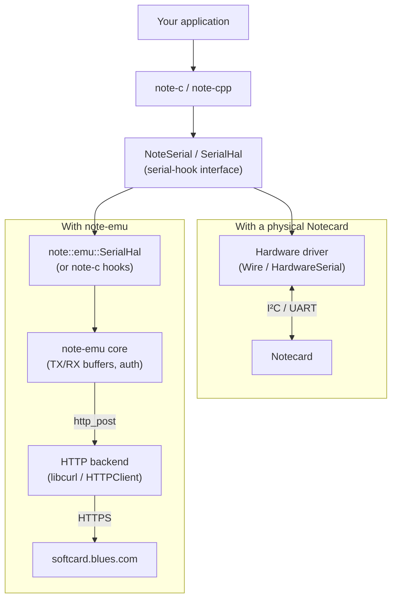

# note-emu

[](https://github.com/m-mcgowan/note-emu/actions/workflows/ci.yml)
[-AAB42F?logo=espressif)](https://wokwi.com/projects/465203727626487809)
[-AAB42F?logo=espressif)](https://wokwi.com/projects/469739119860047873)

A virtual Notecard library for [note-c](https://github.com/blues/note-arduino) and [note-cpp](https://github.com/m-mcgowan/note-cpp).  This provides a drop-in replacement in firmware projects, allowing you to prototype using a virtual Notecard until your physical Notecard is available. 

**Community project.** Not affiliated with or supported by Blues Inc. Notecard is a trademark of Blues Inc.

## Overview

`note-emu`  plugs in to the existing `note-c`/`note-cpp` serial-hook interface and speaks to Blues' cloud-hosted Notecard simulator ("softcard") over HTTP, so your firmware can exercise the real Notecard API before your hardware arrives. Access is granted by a Notehub Personal Access Token that you create.

**How it fits:** you write your application against `note-c` or `note-cpp` Notecard libraries from day one, even without Notecard hardware. If you have an Arduino devkit with networking, you can prototype on that using the virtual Notecard hardware. You can also begin prototyping without any hardware at all by using a complete Wokwi emulated solution.

The simulator plugs in at the transport level. When your Notecard arrives, only the transport setup code needs to change - you swap the `note-emu` transport for the hardware serial/I²C driver — the rest of your application continues to work unchanged against a real Notecard.

### Should I use this in my Product?

Short answer, no! This is intended for rapid prototyping and development. Here's some reasons why you wouldn't want to use this in production.

The main motivations fall into two buckets: things the physical Notecard does that software can't replicate, and things that become cheaper/simpler with dedicated hardware, essentially leveraging many of the strengths that the Notecard in hardware form provides.

**Connectivity that doesn't depend on the device's WiFi:**
- Cellular/Lora/StarNote works where there's no WiFi infrastructure — field deployments, vehicles, agriculture, remote sites
- The Notecard's modem, SIM, and antenna are pre-certified (FCC, CE, etc.) — you skip months of RF certification
- Blues provides the cellular connectivity as a service — no carrier contracts, SIM management, or APN configuration

**Power budget:**
- The physical Notecard sleeps at ~8µA. A virtual Notecard running on a Linux SBC or microcontroller with WiFi would draw orders of magnitude more
- For battery-powered products with multi-year life targets, there's no software substitute for purpose-built low-power hardware
- The Notecard handles its own wake/sleep scheduling independently of the host — the host can be completely off

**Security:**
- The Notecard has its own secure element for device identity and TLS — credentials never touch the host MCU
- A compromised host can't extract the Notecard's private keys, while the virtual Notecard's TLS credentials live in the host's memory/filesystem — same attack surface as any other software

**Reliability at the edge:**
- The Notecard's firmware is hardened for unreliable connectivity — partial sends, session resumption, adaptive backoff. It's been through millions of device-hours of field deployment
- A virtual Notecard daemon on Linux could crash, run out of memory, or lose its queue if the filesystem corrupts
- The physical Notecard has dedicated flash for its note store — independent of the host's storage

**Cost at scale:**
- For a product shipping thousands of units, the Notecard (~$30-50) replaces a WiFi module + antenna + RF design + certification + connectivity software stack
- The BOM might actually go down if you're replacing a WiFi-capable SoC with a cheaper MCU + Notecard

### So why use note-emu?
Prototype on virtual, ship on physical. The Notecard API is identical in both cases, and migration is just a transport change, not a rewrite. The virtual Notecard lowers the barrier to entry, while the physical Notecard is the upgrade path for the finished product. The virtual Notecard is useful for creating hardware-centric tests without the complexity true Hardware-in-loop (HIL) tests.


## Try it without hardware (Wokwi)

### In-browser
The quickest way to see it working — a simulated ESP32 in your browser using a virtual Notecard.

First, set up the project with your credentials:

1. Open https://wokwi.com/projects/465203727626487809
2. Clone the project so you can edit it.
3. Click on the `secrets.h` file tab.
4. Create a PAT using Notehub and uncomment the line `#define NOTEHUB_PAT="..."`, replacing the content between double quotes with your PAT.
5. Optionally, although recommended, uncomment `#define NOTEHUB_PRODUCT` and set this to your notehub product UID.

Once the credentials and product are configured, you can press the "start" button (green play icon) in the simulation window to compile and run the firmware.

### In Visual Studio Code

Open the folder below in VS Code with the [Wokwi extension](https://marketplace.visualstudio.com/items?itemName=wokwi.wokwi-vscode).

- [`wokwi/esp32-notec/`](wokwi/esp32-notec/) — note-c integration
- [`wokwi/esp32-notecpp/`](wokwi/esp32-notecpp/) — note-cpp integration (see [note-cpp examples](#note-cpp-examples))

Copy `src/secrets.h.example` → `src/secrets.h`, edit this file to add your local Wi-Fi credentials, Notehub PAT, and optionally your notehub project UID.

Once the credentials and project are configured

* run `pio run -e wokwi` to build the firmware
* then start the Wokwi simulator.

### Example output

When the example runs, you should see output like this:

<!-- snippet:wokwi/esp32-notec/sample-output.txt:1-37 -->
```text
press enter to start...
note-emu benchmark
WiFi....... connected: 10.13.37.2
note-emu: connecting to https://softcard.blues.com
note-emu: resolving account UID from PAT via billing-accounts API
note-emu: billing-accounts -> rc=0 http=200 [724 ms]
note-emu: resolved account UID: 00000000-0000-0000-0000-000000000000
note-emu: ready (uid=00000000-0000-0000-0000-000000000000)
hub.set product=com.example.you:notec-demo mode=continuous... OK
=== iteration 1/5 ===
note-emu: POST /v1/write (46 bytes) -> rc=0 http=200 [685 ms]
note-emu: POST /v1/read -> rc=0 http=200 bytes=384 [132 ms]
PROFILE req=card.version total=1568
  version = notecard-11.1.1.1301
=== iteration 2/5 ===
note-emu: POST /v1/write (46 bytes) -> rc=0 http=200 [123 ms]
note-emu: POST /v1/read -> rc=0 http=200 bytes=384 [122 ms]
PROFILE req=card.version total=246
  version = notecard-11.1.1.1301
=== iteration 3/5 ===
note-emu: POST /v1/write (46 bytes) -> rc=0 http=200 [153 ms]
note-emu: POST /v1/read -> rc=0 http=200 bytes=384 [112 ms]
PROFILE req=card.version total=266
  version = notecard-11.1.1.1301
=== iteration 4/5 ===
note-emu: POST /v1/write (46 bytes) -> rc=0 http=200 [163 ms]
note-emu: POST /v1/read -> rc=0 http=200 bytes=384 [132 ms]
PROFILE req=card.version total=296
  version = notecard-11.1.1.1301
=== iteration 5/5 ===
note-emu: POST /v1/write (46 bytes) -> rc=0 http=200 [153 ms]
note-emu: POST /v1/read -> rc=0 http=200 bytes=384 [132 ms]
PROFILE req=card.version total=286
  version = notecard-11.1.1.1301
READY
Type a Notecard request as JSON and press Enter, e.g. {"req":"card.temp"}
>
```

After this, you can freely type Notecard commands into the serial terminal to see the results.


## How to use this library

### Embedded MCU

- Arduino-compatible board with networking (ESP32-S3 recommended)
- [PlatformIO](https://platformio.org/) installed
- A [Notehub](https://notehub.io/) account and Personal Access Token (PAT)

### 1. Clone and configure

```sh
git clone https://github.com/m-mcgowan/note-emu
cd note-emu/examples/platformio-notecard

# Create your credentials file
cp src/secrets.h.example src/secrets.h
# Edit src/secrets.h with your WiFi SSID, password, and Notehub PAT
```

### 2. Build and flash

```sh
pio run -t upload
pio device monitor
```

You should see `card.version = notecard-...` — a real response from the softcard simulator.

### Native (desktop, no hardware)

```sh
export NOTEHUB_PAT="your-pat"
make -C examples/native
./examples/native/note-emu-demo
```

## Headers

```cpp
#include <note-emu.h>               // Arduino entry point — C core + note::emu::Arduino
#include <note/emu/note_c.h>        // note-c integration (canonical)
#include <note/emu/note_cpp.hpp>    // note-cpp integration (canonical, requires note-cpp)
#include <note/emu/arduino.hpp>     // Arduino HTTP backend (note::emu::Arduino)
#include <note/emu/curl.h>          // libcurl HTTP backend (native)
```

**Arduino IDE / Wokwi users:** include `<note-emu.h>`, not `<note/emu/arduino.hpp>` directly. Arduino's library auto-detection only adds a library to the include path when it sees a `.h` include from it, so a bare `.hpp` include fails to resolve ([Arduino #5441](https://github.com/arduino/Arduino/issues/5441)). `<note-emu.h>` pulls in the C core and, on Arduino, `note::emu::Arduino`. (PlatformIO uses explicit `lib_deps`, so any of these includes work there.)

**Optional dependencies:** note-cpp is only needed if you include `<note/emu/note_cpp.hpp>` (or the underlying `serial_hal.hpp`). The C core, Arduino wrapper, and libcurl backend have no note-cpp dependency.

### note-cpp examples

The `platformio-notecpp` and `wokwi/esp32-notecpp` projects pull note-cpp from GitHub via their `platformio.ini` `lib_deps` — no additional setup needed. To iterate against a local note-cpp checkout, replace the `note-cpp=https://...` line in the project's `platformio.ini` with `note-cpp=symlink:///abs/path/to/note-cpp`.

## Running note-c and note-cpp side by side

If you want both APIs available in the same sketch — either to migrate a project incrementally from note-c to note-cpp, or to keep legacy raw-JSON call sites alongside new typed-API code — use note-cpp's [bridge mode](https://github.com/m-mcgowan/note-cpp/blob/main/docs/platforms/host/migration-from-note-c.md#bridge-mode-incremental-migration). note-emu ships a ready-to-use bridge helper in `<note/emu/note_cpp_bridge.hpp>`.

The full working example is at [`examples/platformio-bridge/`](examples/platformio-bridge/) (built as part of CI). The relevant lines:

**Includes:**

<!-- snippet:coexistence-includes examples/platformio-bridge/src/main.cpp:18-26 -->
```cpp
// Disable note-cpp's blanket `using namespace note;` — otherwise
// note-arduino's global `Notecard` collides with note-cpp's
// `Notecard` alias for `note::arduino::Notecard`. See note-cpp's
// examples/arduino/note-arduino-bridge/src/main.cpp for context.
#define NOTE_USING_NAMESPACE 0
#include <Notecard.h>                    // note-arduino (brings in note-c + cJSON)
#include <note-cpp.h>                    // note-cpp typed API
#include <note-emu.h>                    // note-emu (auto-pulls note_cpp.hpp bridge base)
#include <note/emu/note_cpp_bridge.hpp>  // note-cpp bridge on top of note-c
```

**Install both:**

<!-- snippet:coexistence-install examples/platformio-bridge/src/main.cpp:59-66 -->
```cpp
// 1. note-c owns the transport (installs global serial hooks
//    pointing at note-emu's virtual Notecard).
softcard.installNoteC();

// 2. note-cpp bridges on top of note-c. Returns a Notecard
//    whose typed calls route through NoteRequestResponseJSON().
auto &nc = note::emu::installNoteCppBridge(softcard);
note::Api api(nc);
```

**Use either API — both talk to the same virtual Notecard:**

<!-- snippet:coexistence-usage examples/platformio-bridge/src/main.cpp:82-103 -->
```cpp
// note-c: raw JSON API. Trace the request/response with JPrintUnformatted.
J *req = NoteNewRequest("hub.set");
JAddStringToObject(req, "product", "com.example.you:bridge-demo");
JAddStringToObject(req, "mode", "continuous");
if (char *s = JPrintUnformatted(req)) { Serial.printf("  > %s\n", s); JFree(s); }
J *rsp = NoteRequestResponse(req);
if (char *s = JPrintUnformatted(rsp)) { Serial.printf("  < %s\n", s); JFree(s); }
Serial.printf("hub.set (note-c): %s\n",
              (rsp && !JGetString(rsp, "err")[0]) ? "OK" : "FAIL");
NoteDeleteResponse(rsp);

// note-cpp: typed API. JSON traces come out via DebugListener::on_wire
// (installed above) — the `>` and `<` lines above each result show the
// wire-format request and response.
auto v = api.card.version().execute();
if (v) {
    Serial.print("card.version (note-cpp): ");
    Serial.println(v.version);
} else {
    Serial.print("card.version FAILED: ");
    Serial.println(v.error());
}
```

### Switching to physical hardware

Once you're comfortable with the bridge pattern against note-emu, the same code carries over to a physical Notecard: swap the note-emu softcard setup for note-arduino's `Notecard::begin()` and everything above the transport stays put. See [`docs/migrating-to-physical-notecard.md`](docs/migrating-to-physical-notecard.md) for the full transport-swap walkthrough, and note-cpp's [migration-from-note-c guide](https://github.com/m-mcgowan/note-cpp/blob/main/docs/platforms/host/migration-from-note-c.md) for the underlying bridge design (the same `NoteCTransport` we wrap in `installNoteCppBridge`).


## Architecture

Everything above the serial-hook interface is identical in both setups — the library, your application, and the request/response API you call. Only the transport underneath changes when you swap between a physical Notecard and note-emu.



## See also

- [docs/migrating-to-physical-notecard.md](docs/migrating-to-physical-notecard.md) — step-by-step migration guide with `note-c` and `note-cpp` before/after code
- [docs/softcard-protocol.md](docs/softcard-protocol.md) — the HTTP wire protocol note-emu speaks to softcard
- [examples/](examples/) — all examples with per-directory READMEs
- [tests/](tests/) — integration tests (native and firmware)
- [tests/unit/](tests/unit/) — Catch2 unit tests (34 tests covering happy + error paths)
