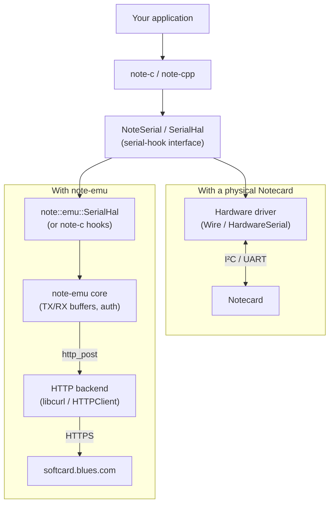

# note-emu

[](https://github.com/m-mcgowan/note-emu/actions/workflows/ci.yml)

A virtual-Notecard transport for the [note-c](https://github.com/blues/note-arduino) and [note-cpp](https://github.com/m-mcgowan/note-cpp) libraries. Plugs into their existing serial-hook interfaces and speaks to Blues' cloud-hosted Notecard simulator ("softcard") over HTTP, so your firmware can exercise the real Notecard API before your hardware arrives.

**How it fits:** you write your application against note-c or note-cpp from day one. note-emu is the transport underneath. When your Notecard arrives, you swap the transport for the hardware serial/I²C driver — your application code is unchanged.

**Community project.** Not affiliated with or supported by Blues Inc. Notecard is a trademark of Blues Inc.

## Try it without hardware (Wokwi)

Fastest way to see it working — a simulated ESP32 in your browser talks to the real softcard service:

- [`wokwi/esp32-softcard/`](wokwi/esp32-softcard/) — note-c integration
- [`wokwi/esp32-notecpp/`](wokwi/esp32-notecpp/) — note-cpp integration

Open in VS Code with the [Wokwi extension](https://marketplace.visualstudio.com/items?itemName=wokwi.wokwi-vscode), copy `src/secrets.h.example` → `src/secrets.h`, add your Notehub PAT, and run `pio run -e wokwi` then start the Wokwi simulator. **Tip:** `diagram.json` already sets `"cpuFrequency": "240"` — Wokwi's default 8 MHz makes TLS handshakes ~30x slower.

## Which path should I use?

| Path | Library | Best for | Example |
|------|---------|----------|---------|
| **note-c** | [blues/note-arduino](https://github.com/blues-inc/note-arduino) | Standard Arduino API, C, familiar to Blues users | [platformio-notecard](examples/platformio-notecard/) |
| **note-cpp** | [note-cpp](https://github.com/m-mcgowan/note-cpp) | Type-safe C++23, compile-time validation, streaming | [platformio-notecpp](examples/platformio-notecpp/) |
| **note-cpp-app** | [note-cpp-app](https://github.com/m-mcgowan/note-cpp-app) | Application framework with publishers, env vars, channels | [platformio-note-cpp-app](examples/platformio-note-cpp-app/) |

**Start with note-c** if you're new to Notecard. Graduate to note-cpp when you want type safety and IDE autocomplete.

## Quick start

### Prerequisites

- ESP32 board with WiFi (ESP32-S3 recommended)
- [PlatformIO](https://platformio.org/) installed
- A [Notehub](https://notehub.io/) account and Personal Access Token (PAT)

### 1. Clone and configure

```sh
git clone https://github.com/m-mcgowan/note-emu
cd note-emu/examples/platformio-notecard

# Create your credentials file
cp src/secrets.h.example src/secrets.h
# Edit src/secrets.h with your WiFi SSID, password, and Notehub PAT
```

### 2. Build and flash

```sh
pio run -t upload
pio device monitor
```

You should see `card.version = notecard-...` — a real response from the softcard simulator.

### Native (desktop, no hardware)

```sh
export NOTEHUB_PAT="your-pat"
make -C examples/native
./examples/native/note-emu-demo
```

## Headers

```cpp
#include <note/emu/emu.h>           // C core API
#include <note/emu/arduino.hpp>     // Arduino wrapper (note::emu::Arduino)
#include <note/emu/serial_hal.hpp>  // note-cpp SerialHal adapter (requires note-cpp)
#include <note/emu/curl.h>          // libcurl backend (native)
```

**Optional dependencies:** note-cpp is only needed if you include `serial_hal.hpp`. The C core, Arduino wrapper, and libcurl backend have no note-cpp dependency.

## Architecture

Everything above the serial-hook interface is identical in both setups — the library, your application, and the request/response API you call. Only the transport underneath changes when you swap between a physical Notecard and note-emu.



## See also

- [examples/](examples/) — all examples with per-directory READMEs
- [tests/](tests/) — integration tests (native and firmware)
- [tests/unit/](tests/unit/) — Catch2 unit tests (34 tests covering happy + error paths)
