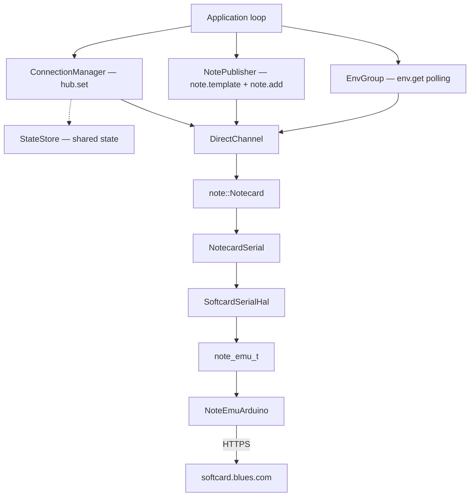

# note-cpp-app + note-emu Example

Application-level Notecard framework over a virtual Notecard. Uses note-cpp-app's `ConnectionManager`, `NotePublisher`, and `EnvVar` for managed hub configuration, template-aware publishing, and cloud-configurable environment variables — all over note-emu's softcard HTTP transport.

## What this demonstrates

- **ConnectionManager** — one-shot `hub.set` configuration with typed `ConnectionConfig`
- **NotePublisher** — automatic template registration on first publish, then compact `note.add`
- **EnvVar / EnvGroup** — typed environment variables fetched from Notehub, with change callbacks
- **StateStore** — observable connection state shared between managers and application code
- **cJSON backend** — production-ready `JsonBackend` from the [platformio-notecpp](../platformio-notecpp/) example
- **Serial command interpreter** — accepts JSON commands from USB serial for integration testing

## Prerequisites

1. ESP32-S3 board (tested with ESP32-S3-DevKitM-1)
2. PlatformIO installed
3. A [Notehub](https://notehub.io) account with a project
4. A Notehub Personal Access Token (PAT)

## Setup

Copy the secrets template and fill in your values:

```sh
cp src/secrets.h.example src/secrets.h
```

Edit `src/secrets.h`:

```cpp
#define WIFI_SSID     "your-wifi-ssid"
#define WIFI_PASS     "your-wifi-password"
#define NOTEHUB_PAT   "your-notehub-pat"
#define PRODUCT_UID   "com.example.your-project"
```

## Build and flash

```sh
pio run -t upload
```

## Expected output

```
WiFi connected: 192.168.1.42

note-emu: resolving device UID...
note-emu: device UID: dev:xxxxxxxxxxxx
note-emu: softcard session established

hub.set OK (com.example.your-project, periodic, outbound=60)
card.version:
  device:  dev:xxxxxxxxxxxx
  version: notecard-7.2.2.16184

Loading environment variables...
  publish_interval = 60
  location         = room-1

Publishing reading: temperature=22.5, humidity=60
  note.add OK

READY
```

After printing `READY`, the firmware accepts JSON commands from USB serial (same protocol as the note-cpp example).

## Cloud configuration

Set environment variables in Notehub to reconfigure the device remotely:

| Variable | Type | Default | Description |
|----------|------|---------|-------------|
| `publish_interval` | int | 60 | Seconds between sensor readings |
| `location` | string | `"room-1"` | Location tag included in published notes |

When a variable changes in Notehub, the device detects it on the next `env.poll()` and prints:

```
Config updated: interval=30, location=lab-2
```

## Architecture



## Key files

| File | Purpose |
|------|---------|
| `src/main.cpp` | Application — connection, publishing, env vars, serial command loop |
| `src/cjson_backend.hpp` | Symlinked from platformio-notecpp example |
| `src/secrets.h` | WiFi and Notehub credentials (gitignored) |
| `platformio.ini` | Build configuration and library dependencies |

## See also

- [note-cpp-app](https://github.com/m-mcgowan/note-cpp-app) — the application framework
- [platformio-notecpp](../platformio-notecpp/) — simpler note-cpp example (no note-cpp-app)
- [platformio-notecard](../platformio-notecard/) — note-arduino (note-c) example
