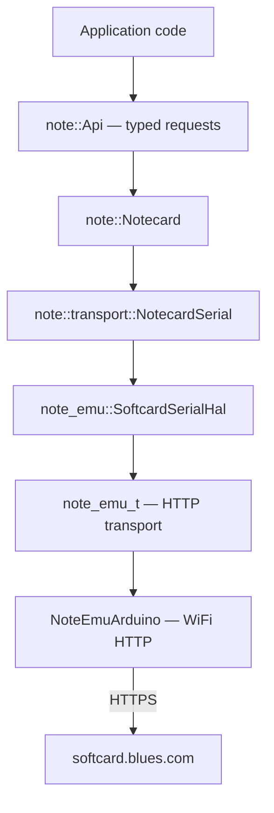

# note-cpp + note-emu Example

Type-safe C++23 Notecard API over a virtual Notecard. Uses note-cpp's generated typed API with note-emu's softcard HTTP transport — no physical Notecard needed.

## What this demonstrates

- **note-cpp typed API** — `api.hubSet().product(...).mode(...).execute()` instead of raw JSON strings
- **Typed body structs** — define a C++ struct once, use it for `note.add`, `note.template`, and response parsing
- **note-emu softcard transport** — `SoftcardSerialHal` bridges note-emu to note-cpp's `SerialHal`
- **cJSON backend** — production-ready `JsonBackend` implementation using ESP-IDF's built-in cJSON
- **Serial command interpreter** — accepts JSON commands from USB serial for integration testing

## Prerequisites

1. ESP32-S3 board (tested with ESP32-S3-DevKitM-1)
2. PlatformIO installed
3. A [Notehub](https://notehub.io) account with a project
4. A Notehub Personal Access Token (PAT)

## Setup

Copy the secrets template and fill in your values:

```sh
cp src/secrets.h.example src/secrets.h
```

Edit `src/secrets.h`:

```cpp
#define WIFI_SSID     "your-wifi-ssid"
#define WIFI_PASS     "your-wifi-password"
#define NOTEHUB_PAT   "your-notehub-pat"
#define PRODUCT_UID   "com.example.your-project"
```

## Build and flash

```sh
pio run -t upload
```

## Expected output

```
WiFi connected: 192.168.1.42

note-emu: resolving device UID...
note-emu: device UID: dev:xxxxxxxxxxxx
note-emu: softcard session established

hub.set OK
card.version:
  device:  dev:xxxxxxxxxxxx
  version: notecard-7.2.2.16184

READY

Sending reading: temperature=22.5, humidity=60
note.add OK (total=1)
```

After printing `READY`, the firmware accepts JSON commands from USB serial:

```
{"req":"card.temp"}
RSP: {"value":23.5,"calibration":-3.0}

{"req":"note.add","file":"test.qo","body":{"x":1},"sync":true}
RSP: {"total":1}
```

## Integration testing

```sh
python3 tests/test_firmware.py --port /dev/cu.usbmodem1434301
```

The test script sends commands over USB serial and verifies events arrive in Notehub. See [tests/](../../tests/) for details.

## Architecture



## Key files

| File | Purpose |
|------|---------|
| `src/main.cpp` | Application — hub.set, card.version, note.add, serial command loop |
| `src/cjson_backend.hpp` | `note::JsonBackend` implementation using cJSON |
| `src/secrets.h` | WiFi and Notehub credentials (gitignored) |
| `platformio.ini` | Build configuration and library dependencies |

## See also

- [note-cpp](https://github.com/m-mcgowan/note-cpp) — the typed API library
- [platformio-notecard](../platformio-notecard/) — same concept using note-arduino (note-c API)
- [PLAN.md](../../PLAN.md) — protocol details
